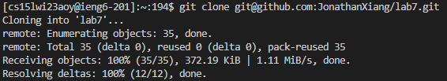

# Lab Report 4
By Jonathan Xiang

## Step 4 - Logging into ieng6

*Keys Pressed:* ssh cs15lwi23aoy@ieng6.ucsd.edu`<enter>`

Because I previously generated an ssh key on the computer I'm using, I didn't have to type in the password to log in.

## Step 5 - Cloning the Forked Repository

*Keys Pressed:* git clone git@github.com:JonathanXiang/lab7.git`<enter>`

Since I had generated an ssh key for my github before, I was able to use the repository's ssh link instead of its https link to clone it.

## Step 6 - 
