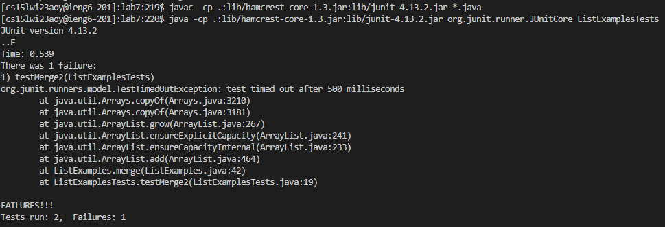
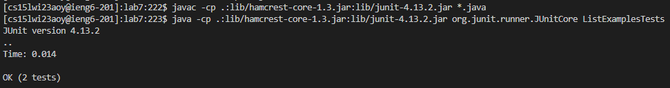
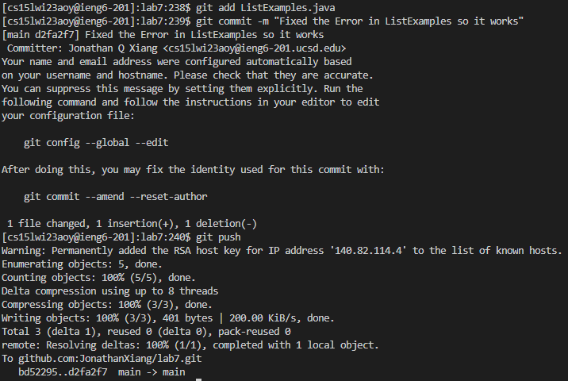

# Lab Report 4
By Jonathan Xiang

## Step 4 - Logging into ieng6

*Keys Pressed:* `ssh cs15lwi23aoy@ieng6.ucsd.edu<enter>`

Because I previously generated an ssh key on the computer I'm using, I didn't have to type in the password to log in.

## Step 5 - Cloning the Forked Repository

*Keys Pressed:* `git clone git@github.com:JonathanXiang/lab7.git<enter>`

Since I had generated an ssh key for my github before, I was able to use the repository's ssh link instead of its https link to clone it.

## Step 6 - Running the Test

*Keys Pressed:* `cd lab7<enter><ctrl + v><enter>java -cp .:lib/hamcrest-core-1.3.jar:lib/junit-4.13.2.jar org.junit.runner.JUnitCore ListExamplesTests<enter>`

Before doing the tasks, I copied `javac -cp .:lib/hamcrest-core-1.3.jar:lib/junit-4.13.2.jar *.java` to my clipboard, allowing me to use `ctrl + v` to quickly paste the command down.

## Step 7 - Fixing the Test

*Keys Pressed:* `nano ListExamples.java<enter><down><down><down><down><down><down><down><down><down><down><down><down><down><down><down><down><down><down><down><down><down><down><down><down><down><down><down><down><down><down><down><down><down><down><down><down><down><down><down><down><down><down><right><right><right><right><right><right><right><right><right><right><right><right><backspace>2<ctrl + o><enter><ctrl + x>`

I opened ListExamples.java in nano and then used the arrow keys to navigate to where I needed to edit the file, changing an `index1` to an `index2`.

## Step 8 - Rerunning the Test

*Keys Pressed:* `<up><up><up><enter><up><up><up><enter>`

Because I used the `javac -cp .:lib/hamcrest-core-1.3.jar:lib/junit-4.13.2.jar *.java` and `java -cp .:lib/hamcrest-core-1.3.jar:lib/junit-4.13.2.jar org.junit.runner.JUnitCore ListExamplesTests` commands in a previous step, I could access those commands again using the up and down arrow keys. I first accessed `javac -cp .:lib/hamcrest-core-1.3.jar:lib/junit-4.13.2.jar *.java` by hitting the up arrow three times. Then, because I just added the `javac -cp .:lib/hamcrest-core-1.3.jar:lib/junit-4.13.2.jar *.java` command to my command history, the `java -cp .:lib/hamcrest-core-1.3.jar:lib/junit-4.13.2.jar org.junit.runner.JUnitCore ListExamplesTests` command was also three up arrow keys away.

## Step 9 - Commiting and Pushing Changes

*Keys Pressed:* `git add ListExamples.java<enter>git commit -m "Fixed the Error in ListExamples so it works"<enter>git push<enter>`

To commit and push the file to my forked repository, I ran the git add, commit, and push commands in that order. I only added ListExamples.java because it is the only file I changed.
