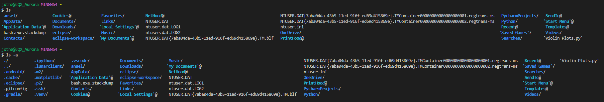
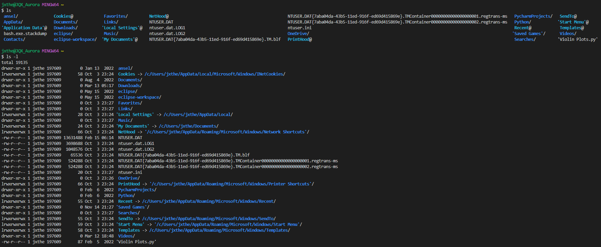
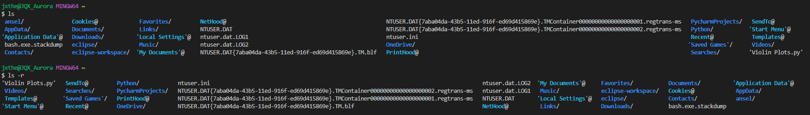
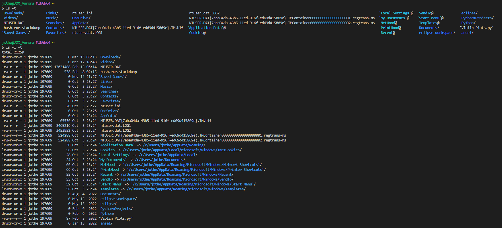
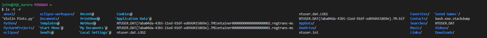

# Lab 5: Options for the ls command
By Jonathan Xiang

## The -a option - [Source](https://www.rapidtables.com/code/linux/ls.html)
`-a` is an option for the ls command that allows you to also see hidden files, which are files that begin with a ".".

As you can see in the image above, using the `ls` command without `-a` yields no files that start with a ".", but using `ls -a` shows many files that start with a ".". You can also see that all the files resulting from the normal `ls` command are also listed in the results of `ls -a`.

## The -l option - [Source](https://www.atatus.com/blog/ls-command-in-linux-with-example)

`-l` is an option for the ls command that lists the files in "long format". "Long format" includes additional information about the files that using ls normally wouldn't give you. This additional information includes owner, file size, and date and time of creation or last modificiation.

As you can see in the image above, using `ls -l` gives you a much longer list with more for each file. This can be useful for when you want to get the information that `ls -l` provides for all the files in a directory. As you can see, if I wanted to see when each of the files in my home directory was last modified or created, I would need to use `ls -l`.

## The -r option - [Source](https://www.atatus.com/blog/ls-command-in-linux-with-example)

`-r` is an option for the ls command that lists the files in reverse.

As you can see, `ls -r` lists the files in reverse order. Since `ls` lists files in alphabetical order, `ls -r` reverse them in reverse alphabetical order. `ls -r` is especially useful for searching really big directories where you know that the file you are searching for will be near the end of a alphabetically ordered list. Of course, there are options that allow ls to be sorted differently, which allow the `-r` option to be used differently too.

## The -t option - [Source](https://www.rapidtables.com/code/linux/ls.html)

`-t` is an option for the ls command that sorts the list of files by their last date and time modified/created, rather than alphabetical order.

As you can see, `ls -t` lists the files in order of timeodified/created, with the most recent modification/creation being first, and the least recent being last. We can tell this is true because by using `ls -l -t` , we can see the data and time modified/created side by side with the order of files.

