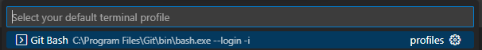
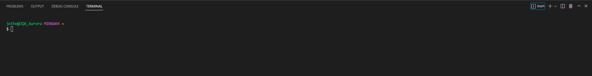
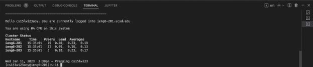
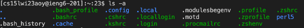

# How to Log into Your CSE 15 Account on ieng6
By: Jonathan Xiang

## Step 1: Install Visual Studio Code

To install Visual Studio Code, go to this [link](https://code.visualstudio.com/) and select
whatever operating system your device is using (mac, Windows, etc.). After you have selected
the correct operating system, click the download button.

When you are done downloading, launch the set up program (the thing you just downloaded).
Following the steps it asks of you should lead you to finishing the installation.

After that, launch VSCode. Your screen should look something like the image below, though
it may have a different color scheme.

## Step 2: Connect Remotely

To connect remotely, if you are on Windows you have to install git bash
in Visual Studio Code. To do that, download git from this [link](https://gitforwindows.org/).

After that, launch VScode and open a terminal with the command Ctrl + \` ,
then, open the command palette with Ctrl + Shift+ P, type in "Select Profile Default",
and select "Git Bash" from the options.

(Yours won't say recently used)

(Yours won't say profiles)

Now, in your terminal window, click the "+" icon. For me this was in the upper
right hand corner, but it maybe different for you. This new terminal is a git
bash terminal.

If you are on mac, you don't have to do any of these steps as git bash is
automatically installed!

To log in with your CSE 15L account, you will type in the following command
except you will replace the "---" with the letters unique to your username.

`ssh cs15wi23---@ieng6.ucsd.edu`

Since it's your first time logging in you will get a message asking
you if you are sure you want to continue connecting, type in "yes" to
this message. You will then be prompted for your password which you
should then type in and after that you will be fully logged in and
should see a screen like the image below.

## Step 3: Try Running Some Commands

You have already successfully logged in using your CSE 15L specific
account, now you can try to run some commands. Some examples of commands
you can try are:

- `cd` Changes directory to the inputted path
- `pwd` Prints the path of the directory you are currently in
- `ls` Lists all files and directories in your current directory
`cp` - Copies the file inputted into the directory or other file inputted. The name of
the file you are trying to copy should come first, then the file or directory you
are trying to copy the file to.
`cat` - Prints out the content of the inputted file. You can print out the contents of
multiple files by inputting multiple file names.

Personally, I used the ls -a command, which shows all the files in the
current directory, including all the hidden files, which are preceded
by periods. This was the result.

Finally, when you want to stop testing commands, you can log out by
typing the command Ctrl + D or be running the "exit" command in the
terminal.
