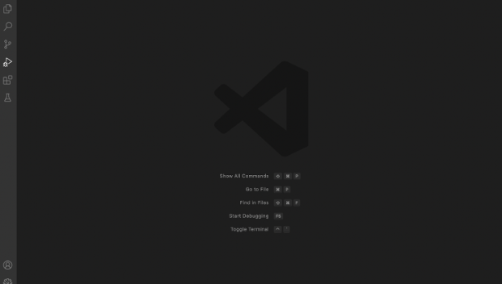

# How to Log into Your CSE 15 Account on ieng6
By Jonathan Xiang

## Step 1: Install Visual Studio Code

To install Visual Studio Code, go to this [link](https://code.visualstudio.com/) and download
Visual Studio Code for whatever operating system your device is using.

When you are done downloading, launch VScode. Your screen should look
something like the image below, though it may have a different color
scheme.

Step 2: Connect Remotely

To connect remotely, if you are on Windows you have to install git bash
in Visual Studio Code. To do that, download git from this [link](https://gitforwindows.org/).

After that open a terminal on VScode with the command Ctrl + \`
