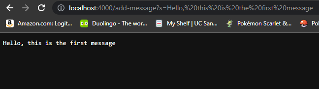
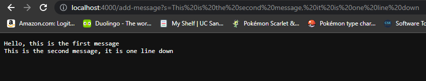
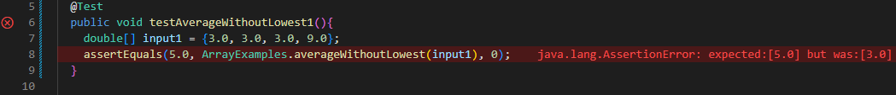
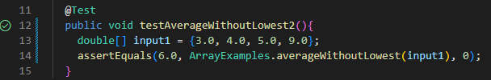

# Lab 2
By Jonathan Xiang

## Part 1: String Server

The code that I wrote for String Server is below:

```
import java.io.IOException;
import java.net.URI;

class Handler implements URLHandler{
    String storedString = "";
    public String handleRequest(URI url){
        if(url.getPath().contains("/add-message")){
            String[] parameters = url.getQuery().split("=");
            storedString += parameters[1] + "\n";
            return storedString;
        }
        else{
            return "404 Not Found";
        }
    }
}
class StringServer{
    public static void main(String[] args) throws IOException {
        if(args.length == 0){
            return;
        }

        int port = Integer.parseInt(args[0]);
        Server.start(port, new Handler());
    }
}
```

In the screenshot below, the handleRequest method is called. The relevant
values for this method are the URI called url, given as a parameter which the
method uses to see what it should do, and the storedString, which is
the String the method will add to everytime "/add-message" is used.
In this case, storedString was changed since "Hello, this is the first message"
and "\n" were concatenated to it.




In this screenshot, the handleRequest method is also called. The relevant methods to
this method are the same as above, but this timem storedString is changed differently.
This time, "This is the second message, it is one line down" is the String appended.
You can also see that it is one line down because of "\n" we appended in the first message.




## Part 2: Bug Testing from Lab 3

In Lab 3, there is a bug in the averageWithoutLowest method in ArrayExamples where
it removes all values that are equal to the lowest instead of just removing one. Below
are the tests I made for this method.

```
@Test
public void testAverageWithoutLowest1(){
  double[] input1 = {3.0, 3.0, 3.0, 9.0};
  assertEquals(5.0, ArrayExamples.averageWithoutLowest(input1), 0);
}
```


This test induces failure. Because multiple of the lowest value exists
in the input list (3.0), all of them are removed and the average is calculated incorrectly.

```
@Test
public void testAverageWithoutLowest2(){
  double[] input1 = {3.0, 4.0, 5.0, 9.0};
  assertEquals(6.0, ArrayExamples.averageWithoutLowest(input1), 0);
}
```


This test doesn't induce failure. Because there is only one of the lowest value (3.0),
only one value is removed and the average is calculated correctly

This is the code of `averageWithoutLowest()` before fixing the bug:
```
static double averageWithoutLowest(double[] arr) {
  if(arr.length < 2) { return 0.0; }
  double lowest = arr[0];
  for(double num: arr) {
    if(num < lowest) { lowest = num; }
  }
  double sum = 0;
  for(double num: arr) {
    if(num != lowest) { sum += num; }
  }
  return sum / (arr.length - 1);
}
```
And this is the code after fixing the bug:

```
static double averageWithoutLowest(double[] arr) {
  if(arr.length < 2) { return 0.0; }
  double lowest = arr[0];
  for(double num: arr) {
    if(num < lowest) { lowest = num; }
  }
  double sum = 0;
  for(double num: arr) {
      sum += num;    
  }
  sum -= lowest;
  return sum / (arr.length - 1);
}
```
To fix the bug, I removed the if statement that prevented the lowest values from being added and instead added a `sum -= lowest`
to subtract the lowest value from the sum at the end, which would have the same result as not including the lowest value. This
fixes the bug because no matter how many values are equal to the lowest, the lowest value only gets removed once since `sum -= lowest`
only runs once no matter what.

## Part 3: Something I Learned

Something I learned in lab 3 was how to debug code with JUnit. Using the`assertEquals()` method, we can test to see if two values are equal, allowing us to test
whether our methods have the desired outputs with given inputs. I also learned that an @Test is written before a test method to indicate it is a test to JUnit. This
way you can decide what you want to be a test and what you don't. Lastly, I also learned that when designing tests, you want to create tests that could be failure inducing. That way you can find where in your method there is an error and make sure you are not missing an error your tests didn't find.
