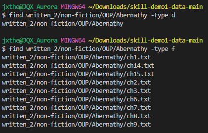
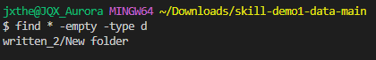

# Lab 3: The find command
By Jonathan Xiang

## The iname option [Source](https://www.computerhope.com/unix/ufind.htm)
`-iname` is an option for the find command that works very similairly to `-name`

As you can see in the image above, the key difference between `-iname` and `-name` is that `-iname` isn't case sensitive. This command is especially useful if you want to find a file with the find command and you know the name, but not to a super accurate degree. `-iname` allows you to find a file even if your capitalization is wrong.

The downside to `-iname` is that if you do know the capitalization of the file you're trying to find, it may give you more information than you need. In the image above, `-name` is able to find the specific WhereToJapan.txt file, while the `-iname` finds that file but also find the wheretojapan.txt file, which you may not want. This may become a bigger problem if you had a lot more files named "wheretojapan" in various formats, cause then you wouldn't be able to easily find the actual file that you want.

## The type option

`-type` is an option for the find command that allows you to search for only a specific type of file.

In the image above, I searched all of written_2 for only directories. As you can see, the result is a list of all the directories in written_2, including written_2 itself (written_2 was shown because my working directory was the folder containing written_2). The option I used to do this was `-type d`. In this option, the "d" specifies that the type we are searching for is directories.

In this example, you can see that running the command using `-type d` returns you the path to the Abernathy directory. On the other hand, using `-type f` returns the path to all the files in Abernathy, but doesn't return the path to the Abernathy directory itself. While `-type d` returns only directories, `-type f` returns only files

## The empty option

`-empty` is an option for the find command that allows you to only search for empty files and directories.

The image above shows the `find` command executing with the `-empty` option. I created a new empty file called "New Text Document" and a new empty directory called "New Folder" to show that `-empty` works. As you can see, the new file and directory are both shown.

Furthermore, in the image above, you can see that by combining the use of the `-empty` and `-type d` commands, we can exclusively search for empty directories. The `-empty` command can be useful for finding folders and files that are not in use.

## The maxdepth option

`-maxdepth` is an option that limits the amount of directories that find can go into when finding files.

As you can see, by limiting the "depth" to 1, the find command only returns written_2 and the directories inside written_2, but doesn't return anything in those directories.

By increasing the maximmum "depth" to 2, the find command can now look one directory deeper. In this case, find can find the directories of "berlitz1", "berlitz2", and "OUP" in addition to the directories that find could find with a maximum "depth" of 1.
